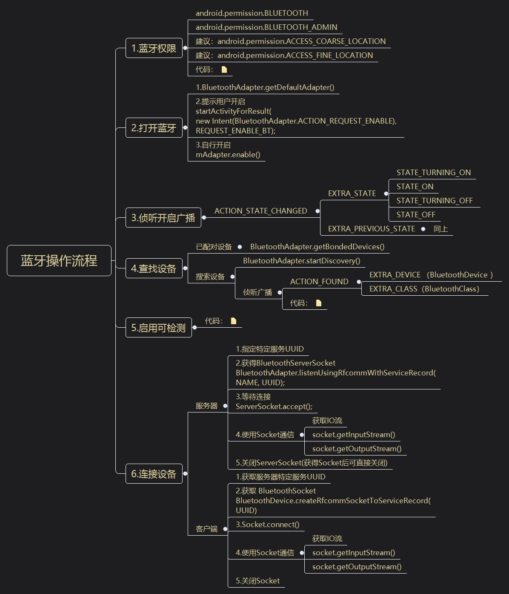

# 目录说明
## BlueToothLeClientDemo 低功耗蓝牙Demo
实现功能：
- 搜索
- 配对
- 读取数据
## BaseBleDemo 传统蓝牙基本操作
实现功能：
- 搜索
- 获得状态
## BaseBleClient 传统蓝牙客户端通讯
实现功能：
- 与服务器简单通讯
## BaseBleServer 传统蓝牙服务器通讯
实现功能
- 与客户端简单通讯
## BaseBleSetPin 实现自动配对
- 自动配对
- 实用工具方法
# 传统蓝牙知识图谱
